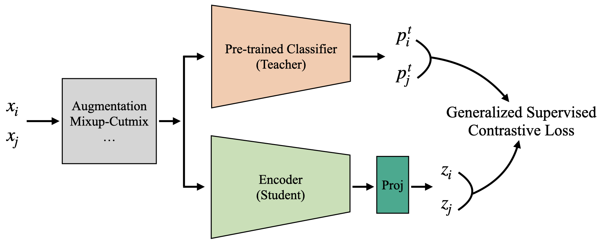
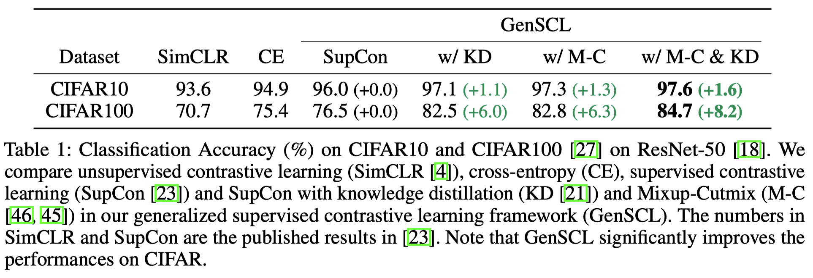
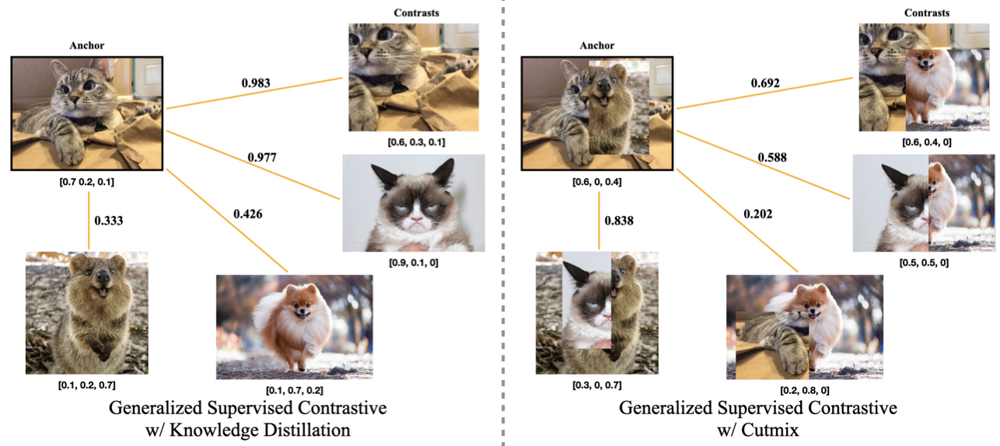

# A Generalized Supervised Contrastive Learning Framework



This is a PyTorch implementation of the GenSCL | [Paper](https://arxiv.org/abs/2206.00384)

Jaewon Kim and Jooyoung Chang and Sang Min Park

[HSDS](http://snuhsds.com/)@Seoul National University

Our implementation is based on the [Supervised Contrastive Learning](https://github.com/HobbitLong/SupContrast) repository.

### Abstract

Based on recent remarkable achievements of contrastive learning in self-supervised representation learning, supervised contrastive learning (SupCon) has successfully extended the batch contrastive approaches to the supervised context and outperformed cross-entropy on various datasets on ResNet. In this work, we present *GenSCL*: a generalized supervised contrastive learning framework that seamlessly adapts modern image-based regularizations (such as Mixup-Cutmix) and knowledge distillation (KD) to SupCon by our *generalized supervised contrastive loss*. Generalized supervised contrastive loss is a further extension of supervised contrastive loss measuring cross-entropy between the similarity of labels and that of latent features. Then a model can learn to what extent contrastives should be pulled closer to an anchor in the latent space. By explicitly and fully leveraging label information, GenSCL breaks the boundary between conventional positives and negatives, and any kind of pre-trained teacher classifier can be utilized. ResNet-50 trained in GenSCL with Mixup-Cutmix and KD achieves state-of-the-art accuracies of 97.6% and 84.7% on CIFAR10 and CIFAR100 without external data, which significantly improves the results reported in the original SupCon (1.6% and 8.2%, respectively). Pytorch implementation is available at https://t.ly/yuUO.

### Overview of the results



## Loss Function

Our proposed *Generalized Supervised Contrastive Loss* in `loss.py`  takes a tuple of `features` and a tuple of `labels` as the input, and returns the loss. If `labels` is one-hot encoded label, it degenerates to Supervised Contrastive Loss.

By *Generalized Supervised Contrastive Loss*, we can seamlessly adapt Mixup/Cutmix and Knowledge Distillation to Supervised Contrastive Learning.



## Running

To apply knowledge distillation, pretrained teacher model (EfficientNetV2-M) is required and released [here](https://www.dropbox.com/sh/io8u9mv8hh3bt4m/AACjNFDZIgPADoyU14OEqVQSa?dl=0).

* CIFAR10

  * Pretraining stage:

    ```bash
    python genscl.py \
    --dataset cifar10 \
    --mix mixup_cutmix \
    --KD \
    --KD-alpha 1 \
    --teacher-path ./pretrained_saves/efficientnetv2_rw_m_ema_mixup_cutmix_cifar10_Adam
    ```

  * Linear evaluation stage:

    ```bash
    python linear.py \
    --dataset cifar10 \
    --pretrained cifar10_bsz_1024_mixup_cutmix_1.0_KD_1.0_SGD_lr_0.5 \
    --augment-policy no \
    --amp
    ```

* CIFAR100

  * Pretraining stage:
  
    ```bash
    python genscl.py \
    --dataset cifar100 \
    --mix mixup_cutmix \
    --KD \
    --KD-alpha 1 \
    --teacher-path ./pretrained_saves/efficientnetv2_rw_m_ema_mixup_cutmix_cifar100_Adam
    ```
  
  * Linear evaluation stage:
  
    ```bash
    python linear.py \
    --dataset cifar100 \
    --pretrained cifar100_bsz_1024_mixup_cutmix_1.0_KD_1.0_SGD_lr_0.5 \
    --augment-policy no \
    --amp
    ```
  

You have several extra options:

* `--optim-kind`: SGD, RMSProp, Adam, AdamW

* `--augment-policy`: no, sim, auto, rand
* `--wandb`: enable [wandb](https://wandb.ai/) for visualization

## Updates

* 23 Jun, 2022: Initial upload

## Citation

```
@article{kim2022generalized,
  title={A Generalized Supervised Contrastive Learning Framework},
  author={Kim, Jaewon and Chang, Jooyoung and Park, Sang Min},
  journal={arXiv preprint arXiv:2206.00384},
  year={2022}
}
```
